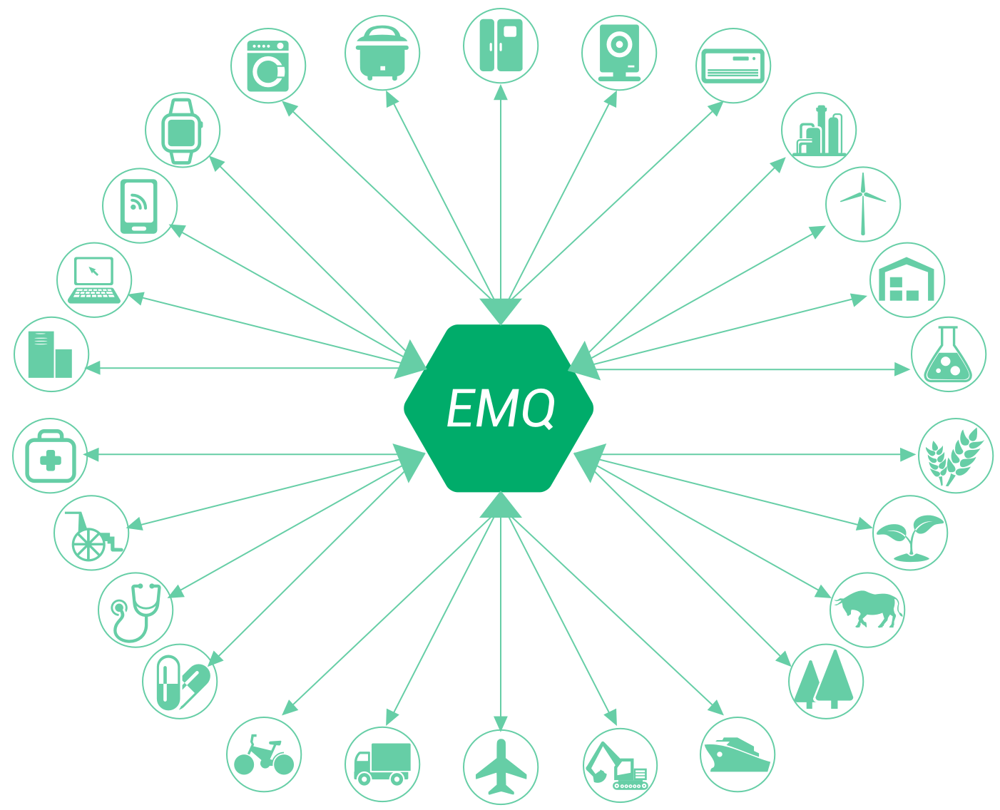
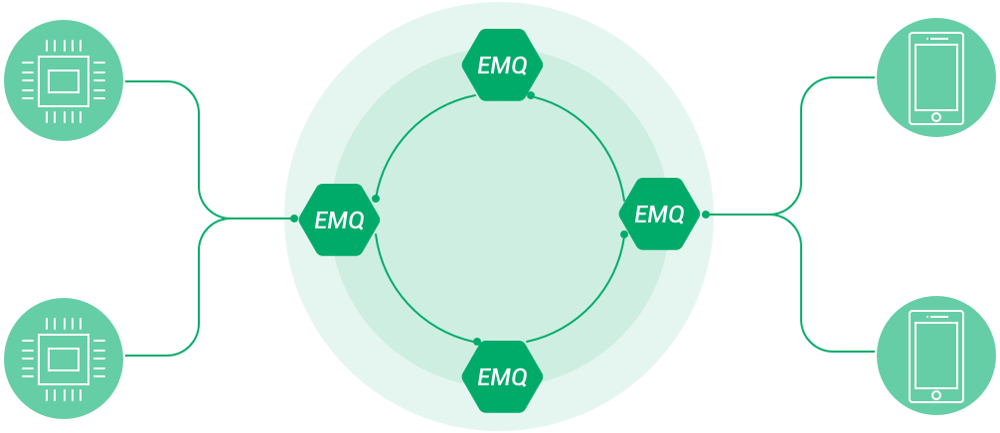

.. EMQ 消息服务器产品白皮书 documentation master file, created by
   sphinx-quickstart on Sun Sep 10 19:34:45 2017.
   You can adapt this file completely to your liking, but it should at least
   contain the root `toctree` directive.

========================
EMQ 消息服务器产品白皮书
========================

产品概述
========

EMQ 是百万级分布式开源物联网 MQTT 消息服务器，通过双向发布订阅消息实时连接物联网终端(Device)、手机(Mobile)、数据(Data)、服务(Service)与应用(Application)。 EMQ 2.0 版本完整支持 MQTT V3.1/V3.1.1 版本协议规范，并扩展支持 WebSocket、Stomp、CoAP、MQTT-SN 或私有 TCP 协议。

EMQ 为大规模终端连接(C1000K+)的物联网、车联网、工业物联网、移动推送、移动消息、智能硬件等应用，提供一个完全开放源码、安装部署简便、企业级稳定可靠、可弹性扩展、易于定制开发的 MQTT 消息服务器。

EMQ 项目采用 Apache 2.0 开源许可协议，最早于2013年由作者李枫在GitHub创建，截至2.3版本发布共经历近九十个版本迭代和演进。EMQ 是目前全球市场领先的开源 MQTT 消息服务器，广泛应用于中国、印度、北美、欧洲近五千个的物联网移动互联网项目。

MQTT 简介
=========

MQTT 是一个轻量发布订阅模式的开放标准物联网协议，由 OASIS 国际开放标准联盟制定，专门针对低带宽、低功耗和不稳定网络连接，需要双向通信的物联网应用设计。

MQTT 协议特别适合连接大规模的物联网终端设备到云端，或实现发布订阅模式的实时双向 M2M 通信。

MQTT 将是 IoT 领域的最重要的标准协议之一，将广泛用于物联网、车联网、工业物联网、智能家居、智慧城市、电力石油能源等行业。

产品特点
========

1. 完全开放源码，基于Apache Version 2.0开源协议；
 
2. 百万级并发连接，单节点承载100万以上 MQTT 连接；
   
3. 毫秒级消息时延，基于Erlang/OTP软实时架构设计；

4. 完整支持 MQTT V3.1.1 协议，QoS 0/1/2消息支持；

5. 分布式集群架构，支持双节点负载均衡或多节点集群；

6. 共享订阅负载消费，支持高性能的发布订阅消息派发；

7. 扩展模块与插件，支持插件方式灵活扩展服务器功能；

8. 简便安装部署，跨平台部署在公有云、私有云或容器。

产品功能
========

* 完整 MQTT V3.1/V3.1.1 协议规范支持

* QoS0, QoS1, QoS2 消息支持

* 持久会话与离线消息支持

* Retained 消息支持

* Last Will 消息支持

* TCP/SSL 连接支持

* MQTT/WebSocket/SSL 支持

* HTTP消息发布接口支持

* $SYS/# 系统主题支持

* 客户端在线状态查询与订阅支持

* 客户端 ID 或 IP 地址认证支持

* 用户名密码认证支持

* HTTP 认证

* LDAP 认证

* JWT Token认证

* Redis、MySQL、PostgreSQL、MongoDB、HTTP 认证集成

* 浏览器 Cookie 认证

* 基于客户端 ID、IP 地址、用户名的访问控制(ACL)

* 多服务器节点集群(Clustering)

* 多服务器节点桥接(Bridge)

* mosquitto 桥接支持

* Stomp 协议支持

* MQTT-SN 协议支持

* CoAP 协议支持

* Stomp/SockJS 支持

* LWM2M 协议支持

* 通过 Paho 兼容性测试

* 本地订阅($local/topic)

* 共享订阅($share/<group>/topic)

* Proxy Protocol V1/2 协议支持

* Lua Hook and Web Hook

架构设计
========

EMQ 基于基于电信级 Erlang/OTP 语言平台设计，高并发、软实时、低延时、容错处理，支持高可靠高可用节点集群。EMQ 集群按主题树(Topic Trie)和路由表(Routing Table)发布订阅模式在集群节点间转发路由 MQTT 消息:

EMQ 集群支持节点自动发现、自动集群，以及脑裂自动恢复；支持 IP Multicast、DNS、Etcd、Kubernetes 等多种自动集群策略。

扩展插件
========

EMQ 消息服务器通过模块注册和钩子(Hooks)机制，支持用户开发扩展插件定制服务器认证鉴权与业务功能。

+---------------------------+---------------------------+
| 插件                      | 说明                      |
+===========================+===========================+
| `emq_dashboard`_          | Web 控制台插件(默认加载)  |
+---------------------------+---------------------------+
| `emq_auth_clientid`_      | ClientId 认证插件         |
+---------------------------+---------------------------+
| `emq_auth_username`_      | 用户名、密码认证插件      |
+---------------------------+---------------------------+
| `emq_auth_ldap`_          | LDAP 认证/访问控制        |
+---------------------------+---------------------------+
| `emq_auth_http`_          | HTTP 认证/访问控制        |
+---------------------------+---------------------------+
| `emq_auth_mysql`_         | MySQL 认证/访问控制       |
+---------------------------+---------------------------+
| `emq_auth_pgsql`_         | PostgreSQ L认证/访问控制  |
+---------------------------+---------------------------+
| `emq_auth_redis`_         | Redis 认证/访问控制       |
+---------------------------+---------------------------+
| `emq_web_hook`_           | Web Hook 插件             |
+---------------------------+---------------------------+
| `emq_lua_hook`_           | Lua Hook 插件             |
+---------------------------+---------------------------+
| `emq_auth_mongo`_         | MongoDB 认证/访问控制     |
+---------------------------+---------------------------+
| `emq_modules`_            | 扩展模块插件              |
+---------------------------+---------------------------+
| `emq_retainer`_           | Retain 消息存储模块       |
+---------------------------+---------------------------+
| `emq_coap`_               | CoAP 协议支持             |
+---------------------------+---------------------------+
| `emq_sn`_                 | MQTT-SN 协议支持          |
+---------------------------+---------------------------+
| `emq_stomp`_              | Stomp 协议支持            |
+---------------------------+---------------------------+
| `emq_sockjs`_             | Stomp/SockJS 协议支持     |
+---------------------------+---------------------------+
| `emq_recon`_              | Recon 性能调试            |
+---------------------------+---------------------------+
| `emq_reloader`_           | Reloader 代码热加载插件   |
+---------------------------+---------------------------+
| `emq_plugin_template`_    | 插件开发模版              |
+---------------------------+---------------------------+

安装部署
========

EMQ 消息服务器可跨平台运行在 Linux、FreeBSD、Mac OS X 或 Windows 服务器上，支持在公有云、私有云、容器云以及物理主机上部署。

EMQ 最新程序包下载:

+------------------------+-------------------------------------------------------+
| CentOS6(64-bit)        | `emqttd-centos6.8-v2.3-beta.3.zip`_                   |
+------------------------+-------------------------------------------------------+
| CentOS6-RPM(64-bit)    | `emqttd-centos6.8-v2.3-beta.3-1.el6.x86_64.rpm`_      |
+------------------------+-------------------------------------------------------+
| CentOS7(64-bit)        | `emqttd-centos7-v2.3-beta.3.zip`_                     |
+------------------------+-------------------------------------------------------+
| CentOS7-RPM(64-bit)    | `emqttd-centos7-v2.3-beta.3-1.el7.centos.x86_64.rpm`_ |
+------------------------+-------------------------------------------------------+
| Debian7(64-bit)        | `emqttd-debian7-v2.3-beta.3.zip`_                     |
+------------------------+-------------------------------------------------------+
| Debian7-DEB(64-bit)    | `emqttd-debian7-v2.3-beta.3_amd64.deb`_               |
+------------------------+-------------------------------------------------------+
| Debian8(64-bit)        | `emqttd-debian8-v2.3-beta.3.zip`_                     |
+------------------------+-------------------------------------------------------+
| Debian8(64-bit)        | `emqttd-debian8-v2.3-beta.3_amd64.deb`_               |
+------------------------+-------------------------------------------------------+
| Debian9(64-bit)        | `emqttd-debian9-v2.3-beta.3.zip`_                     |
+------------------------+-------------------------------------------------------+
| Debian9(64-bit)        | `emqttd-debian9-v2.3-beta.3_amd64.deb`_               |
+------------------------+-------------------------------------------------------+
| Docker                 | `emqttd-docker-v2.3-beta.3.zip`_                      |
+------------------------+-------------------------------------------------------+
| Mac OS X               | `emqttd-macosx-v2.3-beta.3.zip`_                      |
+------------------------+-------------------------------------------------------+
| Ubuntu12.04(64-bit)    | `emqttd-ubuntu12.04-v2.3-beta.3.zip`_                 |
+------------------------+-------------------------------------------------------+
| Ubuntu12.04-DEB(64-bit)| `emqttd-ubuntu12.04-v2.3-beta.3_amd64.deb`_           |
+------------------------+-------------------------------------------------------+
| Ubuntu14.04(64-bit)    | `emqttd-ubuntu14.04-v2.3-beta.3.zip`_                 |
+------------------------+-------------------------------------------------------+
| Ubuntu14.04-DEB(64-bit)| `emqttd-ubuntu14.04-v2.3-beta.3_amd64.deb`_           |
+------------------------+-------------------------------------------------------+
| Ubuntu16.04(64-bit)    | `emqttd-ubuntu16.04-v2.3-beta.3.zip`_                 |
+------------------------+-------------------------------------------------------+
| Ubuntu16.04-DEB(64-bit)| `emqttd-ubuntu16.04-v2.3-beta.3_amd64.deb`_           |
+------------------------+-------------------------------------------------------+
| Windows10(64-bit)      | `emqttd-windows10-v2.3-beta.3.zip`_                   |
+------------------------+-------------------------------------------------------+
| Windows7(64-bit)       | `emqttd-windows7-v2.3-beta.3.zip`_                    |
+------------------------+-------------------------------------------------------+

性能测试
========

EMQ 消息服务器2.0版本，在一台8核心、32G内存CentOS服务器上，MQTT 并发连接压力测试到130万。

100万连接测试参数设置请参考文档: http://docs.emqtt.cn/zh_CN/latest/tune.html

EMQ 与合作伙伴 XMeter 联合提供2.0版本性能测试报告: http://emq-xmeter-benchmark-cn.readthedocs.io/en/latest/

市场应用
========

EMQ 开源 MQTT 消息服务器，GitHub Star 排名第一，全球市场近5000企业用户，30万安装包下载，3000万累计在线终端，众多物联网云平台集成。例如，涂鸦智能在亚马逊 AWS 基于 EMQ 集群部署智能硬件云平台，鲁能智能基于 EMQ 开发电动车充电站桩监测管理平台，HPE 法国基于 EMQ 构建大型企业级物联网平台。

物联网M2M、物联网大数据
-----------------------

物联网终端通过 MQTT 协议实现发布订阅模式的 M2M 通信，物联网网关通过 MQTT 协议上报传感器数据到云平台进行大数据分析和存储。

车联网、电动车站桩管理
----------------------

电动车联网电池监控，电动车、站、桩传感数据采集与分析。鲁能电力基于 EMQ 项目开发了电动车联网数据采集分析平台。

智能硬件、智能家居、智能电器
----------------------------

智能硬件与移动终端通过 MQTT 协议实现双向通信与智能控制。智能家居、智能电器通过 MQTT 协议实时双向连接云端服务器。

智慧城市、智慧医疗、远程教育
----------------------------

智慧城市传感器、智慧医疗终端均可通过 MQTT 协议实时上报检测数据，远程教育等多媒体客户端可采用 MQTT 作为控制通道协议。

电力、石油与能源行业
--------------------

电力、石油、能源等行业户外终端设备，可通过 MQTT 协议卫星链路推送数据到服务端网络，例如实现石油管道监测系统。

SCADA 与工业 4.0
-----------------

采用MQTT协议与物联网架构，改造和实现新型的 SCADA 系统。工业4.0的工厂网络通过 MQTT 协议打造消息总线并实现云端互联。

移动即时消息
-------------

MQTT 协议将在即时消息领域取代 XMPP 协议，移动消息例如 Facebook Messenger 采用 MQTT 协议，中国移动基于 EMQ 开发即时消息服务端。

联系我们
========

EMQ 项目由杭州映云科技有限公司提供技术支持。

公司: 杭州映云科技有限公司 

官网: http://www.emqtt.com 

电话: 400-696-5502 

邮箱: contact@emqtt.io 

微信: emqttd 

微博: http://weibo.com/emqtt 

Twitter: @emqtt

.. _emq_dashboard:        https://github.com/emqtt/emqttd_dashboard
.. _emq_modules:          https://github.com/emqtt/emq-modules
.. _emq_retainer:         https://github.com/emqtt/emq-retainer
.. _emq_mod_retainer:     https://github.com/emqtt/emq_mod_retainer
.. _emq_mod_presence:     https://github.com/emqtt/emq_mod_presence
.. _emq_mod_subscription: https://github.com/emqtt/emq_mod_subscription
.. _emq_auth_clientid:    https://github.com/emqtt/emq_auth_clientid
.. _emq_auth_username:    https://github.com/emqtt/emq_auth_username
.. _emq_auth_ldap:        https://github.com/emqtt/emq_auth_ldap
.. _emq_auth_http:        https://github.com/emqtt/emq_auth_http
.. _emq_auth_mysql:       https://github.com/emqtt/emq_auth_mysql
.. _emq_auth_pgsql:       https://github.com/emqtt/emq_auth_pgsql
.. _emq_auth_redis:       https://github.com/emqtt/emq_auth_redis
.. _emq_auth_mongo:       https://github.com/emqtt/emq_auth_mongo
.. _emq_mod_rewrite:      https://github.com/emqtt/emq_mod_rewrite
.. _emq_web_hook:         https://github.com/emqtt/emq-web-hook
.. _emq_lua_hook:         https://github.com/emqtt/emq-lua-hook
.. _emq_sn:               https://github.com/emqtt/emq_sn
.. _emq_coap:             https://github.com/emqtt/emq_coap
.. _emq_stomp:            https://github.com/emqtt/emq_stomp
.. _emq_sockjs:           https://github.com/emqtt/emq_sockjs
.. _emq_recon:            https://github.com/emqtt/emq_recon
.. _emq_reloader:         https://github.com/emqtt/emq_reloader
.. _emq_plugin_template:  https://github.com/emqtt/emq_plugin_template
.. _recon:                http://ferd.github.io/recon/

.. _emqttd-centos6.8-v2.3-beta.3.zip:                   http://emqtt.com/downloads/latest/centos6
.. _emqttd-centos6.8-v2.3-beta.3-1.el6.x86_64.rpm:      http://emqtt.com/downloads/latest/centos6-rpm
.. _emqttd-centos7-v2.3-beta.3.zip:                     http://emqtt.com/downloads/latest/centos7
.. _emqttd-centos7-v2.3-beta.3-1.el7.centos.x86_64.rpm: http://emqtt.com/downloads/latest/centos7-rpm
.. _emqttd-debian7-v2.3-beta.3.zip:                     http://emqtt.com/downloads/latest/debian7
.. _emqttd-debian7-v2.3-beta.3_amd64.deb:               http://emqtt.com/downloads/latest/debian7-deb
.. _emqttd-debian8-v2.3-beta.3.zip:                     http://emqtt.com/downloads/latest/debian8
.. _emqttd-debian8-v2.3-beta.3_amd64.deb:               http://emqtt.com/downloads/latest/debian8-deb
.. _emqttd-debian9-v2.3-beta.3.zip:                     http://emqtt.com/downloads/latest/debian9
.. _emqttd-debian9-v2.3-beta.3_amd64.deb:               http://emqtt.com/downloads/latest/debian9-deb
.. _emqttd-docker-v2.3-beta.3.zip:                      http://emqtt.com/downloads/latest/docker
.. _emqttd-macosx-v2.3-beta.3.zip:                      http://emqtt.com/downloads/latest/macosx
.. _emqttd-ubuntu12.04-v2.3-beta.3.zip:                 http://emqtt.com/downloads/latest/ubuntu12_04
.. _emqttd-ubuntu12.04-v2.3-beta.3_amd64.deb:           http://emqtt.com/downloads/latest/ubuntu12_04-deb
.. _emqttd-ubuntu14.04-v2.3-beta.3.zip:                 http://emqtt.com/downloads/latest/ubuntu14_04
.. _emqttd-ubuntu14.04-v2.3-beta.3_amd64.deb:           http://emqtt.com/downloads/latest/ubuntu14_04-deb
.. _emqttd-ubuntu16.04-v2.3-beta.3.zip:                 http://emqtt.com/downloads/latest/ubuntu16_04
.. _emqttd-ubuntu16.04-v2.3-beta.3_amd64.deb:           http://emqtt.com/downloads/latest/ubuntu16_04-deb
.. _emqttd-windows10-v2.3-beta.3.zip:                   http://emqtt.com/downloads/latest/windows10
.. _emqttd-windows7-v2.3-beta.3.zip:                    http://emqtt.com/downloads/latest/windows7

